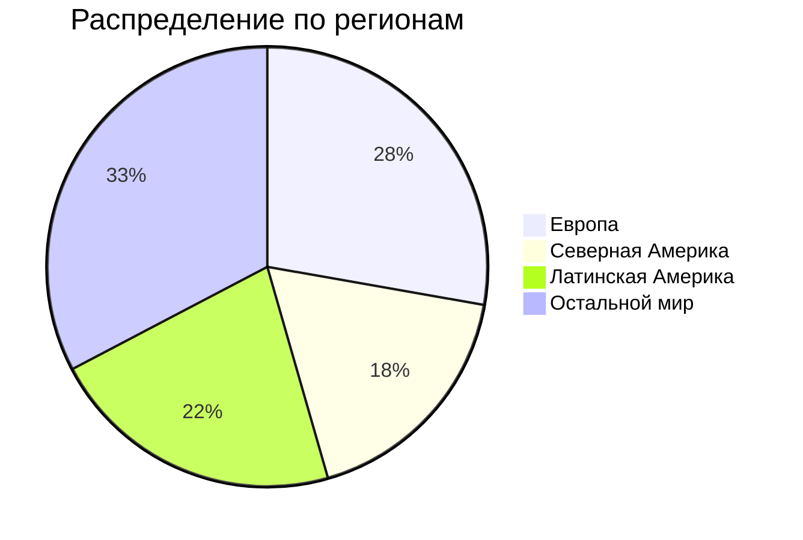

# ДЗ по курсу "Хайлоад"
## 1. Тема и целевая аудитория
### Тема
**Spotify** - стриминговый сервис для прослушивания музыки  
### Аудитория 
Согласно данным отчета за 2-й квартал 2024 года, суммарное число активных пользователей сервиса за месяц составляет **626 млн**.

### Ключевой функционал
* регистрация;
* прослушивать музыку;
* создавать плейлисты;
* серверная история недавно прослушанных песен;
* плейлисты с рекомендациями;
* статистика по исполнителю;
* загрузка музыки;
* поиск музыки.
### Ключевые продуктовые решения
* композиции хранятся на серверах продукта.
## 2.Расчет нагрузки
### Продуктовые метрики
| Метрика                                          	|             Значение метрики 	|
|--------------------------------------------------	|-----------------------------:	|
| Месячная аудитория                               	|                      626 млн 	|
| Дневная аудитория                                	|                     15.7 млн 	|
| Средний размер хранилища на пользователя         	|                      ~25 МБ* 	|
| Среднее время прослушивания за день              	| 148 минут (~40 разных песен) 	|
| Среднее количество созданных плейлистов за день**	|                       63 млн 	|
| Среднее число регистраций за день                	|                   ~130 тысяч 	|

> \* *20 МБ как максимальный размер аватарки + мета информация о пользователе и его плейлистах*  
> \** *включает в себя созданные пользователями и сгенерированные системой рекомендаций плейлисты*
### Технические метрики
#### Хранилища
Объем хранилища пользователей вычисляется простым перемножением числа пользователей на размер профиля пользователя: $626 млн \times 25 МБ$

Для вычисления объема хранилища, выделяемого на музыку, примем, что каждая песня сохраняется в 4 вариантах качества: низком, среднем, высоком и очень высоком и что всего их (на сентябрь 2024 года) 108 миллионов. Средний размер каждого из соответственно составляет 540 КБ, 2.16 МБ, 3.6 МБ и 7.2 МБ. Таким образом, на каждую композицию выделяется в среднем 13.5 МБ, а общий объем хранилища можно принять равным: $108 млн \times 13.5 МБ$

| Хранилище    	| Размер, ТБ 	|
|--------------	|-----------:	|
| Пользователи 	|      12520 	|
| Музыка       	|       1458 	|

#### Сетевой трафик

## Используемая литература
1. [Spotify](https://open.spotify.com/)
2. [Квартальный отчет](https://investors.spotify.com/financials/default.aspx#quarterly-results)
3. [Hypestat](https://hypestat.com/info/spotify.com)
4. [Insights into Spotify Listening Statistics: Millions of Users and Tracks](https://wifitalents.com/statistic/spotify-listening/)
5. [Exploring Eye-Opening Spotify Playlist Statistics: 4 Billion Playlists Created](https://gitnux.org/spotify-playlist-statistics/)

