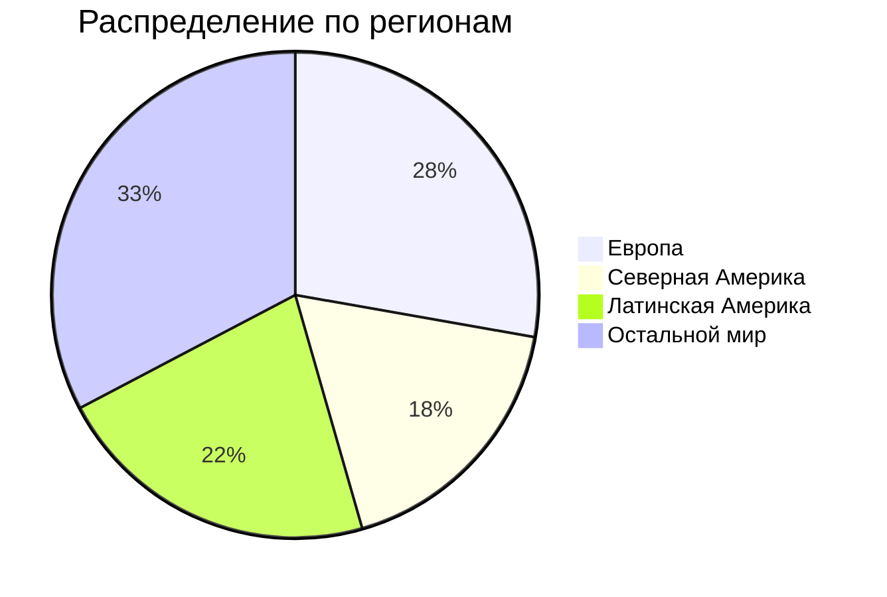

# ДЗ по курсу "Хайлоад"
## Содержание
1. [Тема и целевая аудитория](#1-тема-и-целевая-аудитория)
2. [Расчет нагрузки](#2-расчет-нагрузки)
3. [Глобальная балансировка нагрузки](#3-глобальная-балансировка-нагрузки)
4. [Локальная балансировка нагрузки](#4-локальная-балансировка-нагрузки)
5. [Логическая схема БД](#5-логическая-схема-бд)
6. [Физическая схема БД](#6-физическая-схема-бд)
7. [Алгоритмы](#7-алгоритмы)
8. [Технологии](#8-технологии)
## 1. Тема и целевая аудитория
### Тема
**Spotify** - стриминговый сервис для прослушивания музыки[^1]  
### Аудитория 
Согласно данным отчета за 2-й квартал 2024 года[^2], суммарное число активных пользователей сервиса за месяц составляет **626 млн**.

### Ключевой функционал
* регистрация;
* прослушивать музыку;
* создавать плейлисты;
* серверная история недавно прослушанных песен;
* плейлисты с рекомендациями;
* статистика по исполнителю;
* загрузка музыки;
* поиск музыки.
### Ключевые продуктовые решения
* композиции хранятся на серверах продукта.
## 2. Расчет нагрузки
### Продуктовые метрики
| Метрика                                          	                | Значение метрики 	|
|-----------------------------------------------------------------	|---------------------------------:	|
| Месячная аудитория                               	                |                          626 млн 	|
| Дневная аудитория                                	                |                     15.7 млн[^3] 	|
| Средний размер хранилища на пользователя         	                |                          ~20 МБ* 	|
| Среднее время прослушивания за день пользователем                 | 148 минут (~40 разных песен)[^4] 	|
| Среднее количество созданных плейлистов за день	                |                      1.3 млн[^5] 	|
| Среднее количество добавлений/удалений песен из плейлиста за день	|                         31.4 млн  |
| Среднее количество поисков за день                                |                         62.8 млн 	|
| Среднее число регистраций/авторизаций за день                     |                      15.83 млн** 	|

> \* максимальный размер аватарки (~15 МБ с учетом сжатия WebP) + мета информация о пользователе и его плейлистах  
> \*\* авторизация активных пользователей в течение дня (15.7 млн) и регистрация новых (в среднем 130 тысяч)
### Технические метрики
#### Хранилища
Для вычисления объема хранилища, выделяемого на музыку, примем, что каждая песня сохраняется в 4 вариантах качества: низком, среднем, высоком и очень высоком и что всего их (на сентябрь 2024 года) 108 миллионов. Средний размер их (для песни длиной 3 минуты) соответственно составляет 540 КБ, 2.16 МБ, 3.6 МБ и 7.2 МБ[^6]. Таким образом, на каждую композицию выделяется в среднем 13.5 МБ.

| Хранилище 	| Размер, ТБ 	|
|---	|---	|
| Пользователи 	| 626 млн × 20  МБ = 12520	|
| Музыка 	| 108 млн × 13.5  МБ = 1458 	|

За последние несколько лет средний прирост пользователей составлял 15-20%. Если такой темп роста сохранится, то через год можно ожидать общей активной аудитории сервиса в районе 700 млн.  
Для расчета роста хранилища композиций учтем, что каждый день исполнители добавляют в среднем 60 тыс. новых песен[^7], что должно привести к росту библиотеки сервиса на 21.9 млн треков за год.

| Хранилище 	| Прирост за год, ТБ 	|
|---	|---	|
| Пользователи 	| 74 млн × 20  МБ = 1480	|
| Музыка 	| 21.9 млн × 13.5  МБ = 295.65 	|

#### Сетевой трафик
Для вычисления сетевого трафика прежде всего с помощью ручного замера инструментами разработчика браузера были получены средние размеры ответов на различные действия пользователя:
| Действие пользователя 	| Средний размер ответа, Кбайт 	|
|---	|---:	|
| Поиск 	| 1500 	|
| Создание плейлиста 	| 20 	|
| Добавление/удаление из плейлиста 	| 5.2 	|
| Регистрация/авторизация 	| 16 	|

Битрейт песен в зависимости от качества составляет от 24 до 320 Кбит/c[^6]. Для вычисления сетевого трафика прослушивания музыки будем использовать средний битрейт, равный: (320 + 24) ÷ 4 = 150 Кбит/с.  
Пиковое суточное потребление примем за тройное среднее суточное потребление.
| Действие пользователя 	| Суммарный суточный, Гбайт/сутки 	| Среднее потребление в течение суток, Гбит/с 	| Пиковое потребление  в течение суток, Гбит/с 	| RPS 	|
|---	|:---:	|:---:	|:---:	|:---:	|
| Прослушивание музыки 	| 15.7&nbsp;млн × 148 × 60&nbsp;с × 150&nbsp;Кбит/c = 20&nbsp;912&nbsp;400 	| 20&nbsp;912&nbsp;400 × 8 ÷ 86&nbsp;400&nbsp;с = 1936.3 	| 5 809 	| 15.7&nbsp;млн × 148&nbsp;мин × 6* ÷ 86&nbsp;400&nbsp;с = 161&nbsp;361 	|
| Поиск 	| 62.8&nbsp;млн × 1500&nbsp;КБ = 94&nbsp;200 	| 94&nbsp;200 × 8 ÷ 86&nbsp;400&nbsp;с = 8.72 	| 26.17 	| 62.8&nbsp;млн ÷ 86&nbsp;400&nbsp;с = 727 	|
| Создание плейлиста 	| 1.3&nbsp;млн × 20&nbsp;КБ = 26 	| 26 × 8 ÷ 86&nbsp;400&nbsp;с = 0.0024 	| 0.006 	| 1.3&nbsp;млн ÷ 86&nbsp;400&nbsp;с = 15 	|
| Добавление/удаление из плейлиста 	| 31.4&nbsp;млн × 5.2&nbsp;КБ = 163.3 	| 163.3 × 8 ÷ 86&nbsp;400&nbsp;с = 0.015 	| 0.05 	| 31.4&nbsp;млн ÷ 86&nbsp;400&nbsp;с = 363 	|
| Регистрация/авторизация 	| 15.83&nbsp;млн × 16&nbsp;КБ = 253.3 	| 253.3 × 8 ÷ 86&nbsp;400&nbsp;с = 0.024 	|  0.072 	| 15.83&nbsp;млн ÷ 86&nbsp;400&nbsp;с = 183 	|

> \* запрос данных песни происходит каждые 10 секунд (6 раз в минуту)  

## 3. Глобальная балансировка нагрузки
### Функциональное разбиение по доменам
Нет смысла выделять больше одного функционального домена, поскольку высокая нагрузка на сервера связана только с прослушиванием музыки.
### Обоснование выбора CDN
Исходя из расчета сетевого трафика (п. 2), наибольшая нагрузка связана с прослушиванием музыки. Таким образом, вместо большого числа датацентров лучше использовать CDN для раздачи статики и стриминга музыки. Провайдером выберем Akamai, поскольку он обладает крупнейшей сетью CDN, очень тесно интегрированной с интернет-провайдерами. Это позволит добиться высокой скорости доставки контента пользователям по всему миру.  
### Обоснования расположения ДЦ
Для выбора локаций датацентров будем учитывать данные о распределении пользователей сервиса по странам[^8], общее распределение трафика по различным частям света (п. 1) и расположение подводных кабелей[^9].

| Обслуживаемый регион 	| Название (страна и город) 	| Обоснование выбора 	|
|---	|---	|---	|
| Северная Америка 	| Digital Reality - NYC1 (Нью-Йорк, США) 	| сертифицированный Tier-4 датацентр; вблизи нескольких подводных кабелей, связывающих Северную Америку с Южной и Европой; в США проходит наибольший трафик Spotify 	|
| Латинская Америка 	| Ascenty - Vinhedo 1 (Сан-Паулу, Бразилия) 	| сертифицированный Tier-4 датацентр; вблизи подводных кабелей, связывающих Латинскую Америку с Северной; большой трафик Spotify 	|
| Европа 	| Shield House (Глостер, Великобритания) 	| сертифицированный Tier-3 датацентр; вблизи большого числа подводных кабелей, соединяющих Великобританию почти со всем миром; большой трафик Spotify 	|
| Европа 	| Equinix GN1 (Генуя, Италия) 	| Tier-3 датацентр; вблизи большого числа подводных кабелей, связывающих Италию с Азией и другими странами Европы 	|
| Африка, Центральная Азия 	| STT Mumbai DC3 (Мумбаи, Индия) 	| Tier-3 датацентр; вблизи большого числа подводных кабелей, связывающих Индию с островами Океании и Австралией; большой трафик Spotify	|
| Восточная Азия, Океания и Австралия 	| Equinix SG2 (Сингапур) 	| Tier-3 датацентр; вблизи подводных кабелей, связывающих Сингапур с другими странами Азии, Океанией и Австралией, а также Северной Америкой	|

> _синими маркерами_ обозначены города, в которых находятся датацентры  
> _цветные линии_ - подводные кабели

### Расчет распределение запросов по датацентрам
Для проведения расчетов будем пользоваться приведенной в п. 1 статистикой об использовании сервиса в разных частях света. Если на один регион приходится несколько датацентров, примем, что нагрузка между ними распределена равномерно:
| Датацентр 	| Трафик 	|
|---	|---:	|
| Digital Reality - NYC1 (Нью-Йорк, США) 	| 18% 	|
| Ascenty - Vinhedo 1 (Сан-Паулу, Бразилия)    | 22% 	|
| Shield House (Глостер, Великобритания) 	| 28% ÷ 2 = 14% 	|
| Equinix GN1 (Генуя, Италия) 	| 28% ÷ 2 = 14% 	|
| STT Mumbai DC3 (Мумбаи, Индия) 	| 33% ÷ 2 = 16.5% 	|
| Equinix SG2 (Сингапур) 	| 33% ÷ 2 = 16.5% 	|

С учетом полученных данных можно провести итоговый расчет распределения RPS по датацентрам для различных действий пользователя (на основе расчетов из п. 2)
| Датацентр 	| RPS прослушивания музыки 	| RPS поиска	| RPS создания плейлиста	| RPS добавления/удаления из плейлиста	| RPS регистрации/авторизации	|
|---	|---	|---	|---	|---	|---	|
| Digital Reality - NYC1 (Нью-Йорк, США) 	| 29045 	| 131 	| 3 	| 66 	| 33 	|
| Ascenty - Vinhedo 1 (Сан-Паулу, Бразилия) 	|  	35500 	| 160 	| 4 	| 80 	| 41 |
| Shield House (Глостер, Великобритания) 	| 22591 	| 102 	| 3 	| 51 	| 26 	|
| Equinix GN1 (Генуя, Италия) 	| 22591 	| 102 	| 3 	| 51 	| 26 	|
| STT Mumbai DC3 (Мумбаи, Индия) | 26625 	| 120 	| 3 	| 60 	| 31 	|
| Equinix SG2 (Сингапур) 	| 26625 	| 120 	| 3 	| 60 	| 31 	|
### Схема DNS балансировки
Для балансировки DNS будет использована технология **latency-based DNS**, поскольку это поможет добиться минимальных задержек трафика, что является крайне важным для глобально доступного сервиса.
## 4. Локальная балансировка нагрузки
### Схема балансировки для входящих запросов
* Для обработки входящих запросов в ДЦ будем использовать L7 балансировку при помощи **nginx**, поскольку это позволит нам добиться наибольшей производительности при обработке запросов. Также nginx позволит нам более эффективно обслуживать длительные соединения и проверять авторизацию пользователей перед тем, как допускать их до сервиса;
* будем применять 2 машины с nginx, трафик между которыми будет распределяться при помощи **BGP**.
### Схема балансировки для межсервисных запросов
Межсервисная балансировка будет обеспечиваться при помощи sidecar proxy, поскольку он позволит добиться меньшей задержки, чем другие технологии.
### Схема отказоустойчивости
* В первую очередь отказоустойчивость сервисов будет обеспечена средствами Kubernetes: auto-scaling для динамического изменения количества экземпляров в зависимости от нагрузки, автоматическое восстановление упавших узлов и т.д.;
* nginx также сможет способствовать отказоустойчивости, перенаправляя запрос на другой сервер при слишком долгом таймауте;
* балансировка nginx с BGP повысит отказоустойчиость системы, направляя весь трафик на рабочую машину при выводе из строя другой.  
### Терминация SSL
Терминация SSL будет производиться при помощи session tickets. Это позволит ускорить процесс аутентификации и избавить сервер от необходимости кэшировать сессии.
## 5. Логическая схема БД

| Таблица 	| Требования конситентности 	|
|---	|---	|
| User 	| id - PK email - уникальный  username - уникальный 	|
| Profile 	| id - PK 	|
| Session 	| user_id и session_id - PK 	|
| Music 	| id - PK 	|
| Album 	| id - PK 	|
| Artist 	| id - PK 	|
| Genre 	| id - PK 	|
| Playlist 	| id - PK 	|
| PlaylistMusic 	| playlist_id и music_id - PK 	|
| FavoriteMusic 	| user_id и music_id - PK 	|
| WeeklyRecommendations 	| user_id и music_id - PK 	|
| DailyRecommendations 	| user_id и music_id - PK 	|
| ListeningHistory 	| user_id и music_id - PK 	|

## 6. Физическая схема БД

### Расчет размера данных
| Таблица 	| Размеры данных (Гб) 	|
|---	|---	|
| User 	| 626 млн * (8 + (64 + 4) + (64 + 4) + (128 + 4)) байт = 172.8 	|
| Profile 	| 626 млн * (8 + 2 + 4 + (64 + 4) + (255 + 4) + 1 + 8 + 8) байт = 	|
| Session 	| 15.7 млн * (8 + (64 + 4) + 1) байт = 	|
| Music 	| 108 млн * (8 + (64 + 4) + (255 + 4) + 2 + 8 + 8 + 1 + 8 + 8) байт = 	|
| Album 	| 8 млн * ((8 + (64 + 4) + (255 + 4) + 8 + 1 + 8 + 8) * 4) байт = 	|
| Artist 	| 8 млн * (8 + (64 + 4) + (255 + 4) + (128 + 4) + 1 + 8 + 8) байт = 	|
| Genre 	| 5000 * (8 + (64 + 4) + 1) байт = 	|
| Playlist 	| 8 млрд * (8 + (64 + 4) + (255 + 4) + 8 + 1 + 1 + 8 + 8) байт = 	|
| PlaylistMusic 	| 8 млрд * ((8 + 8 + 1) * 50) байт = 	|
| FavoriteMusic 	| 626 млн * ((8 + 8 + 1) * 500) байт = 	|
| WeeklyRecommendations 	|  	|
| DailyRecommendations 	|  	|
| ListeningHistory 	|  	|
### Индексы
| Таблица 	| Индексы 	|
|---	|---	|
| User 	| **email, username** - 2 отдельных индекса, поскольку пользователь может войти по любому из этих полей 	|
| Profile 	| **user_id** - для поиска информации о профиле после того, как пользователь вошел и user_id получен 	|
| Session 	| **session_id** - для поиска сессии по её идентификатору 	|
| Music 	| **id** - для поиска трека по id для плейлиста, списка избранного, истории прослушенного и рекомендаций name - для пользовательского поиска трека по его названию  album_id - для поиска песен из альбома genre_id - для поиска песен определенного жанра 	|
| Album 	| **id** - для поиска информации об альбоме для трека name - для пользовательского поиска альбома по его названию artist_id - для поиска альбомов определенного автора 	|
| Artist 	| **id** - для поиска информации об авторе для альбома name - для пользовательского поиска музыканта по его имени 	|
| Playlist 	| **name** - для пользовательского поиска плейлистов по их названию user_id - для поиска плейлистов конкретного пользователя 	|
| PlaylistMusic 	| **playlist_id** - для поиска музыки из конкретного плейлиста 	|
| FavoriteMusic 	| **user_id** - для поиска музыки из списка избранного конкретного пользователя 	|
| WeeklyRecommendations 	| **user_id** - для поиска музыки из списка рекомендаций конкретного пользователя 	|
| DailyRecommendations 	| **user_id** - для поиска музыки из списка рекомендаций конкретного пользователя 	|
| ListeningHistory 	| **user_id** - для поиска музыки из истории конкретного пользователя 	|
### Денормализация
В целях обеспечения более быстрого поиска и уменьшения количества JOIN-ов для таблиц PlaylistMusic, FavoriteMusic, ListeningHistory, DailyRecommendations, WeeklyRecommendations были добавлены поля artist_name, album_image и duration. В таблицу Music были добавлены поля artist_name, artist_image, album_name и album_image.
### Выбор СУБД
#### Хранение сессий пользователей
Таблица Session, предназначенная для сохранения сессий пользователей, управляется при помощи Redis. Это позволит добиться скорости при чтении и записи, а также удобства удаления просроченных сессий с помощью задания им TTL.
#### Данные пользователей, музыка и исполнители
Для достаточной скорости обработки запросов и возможности горизонтального масштабирования в качестве основной СУБД для большинства таблиц (кроме Session) была выбрана Cassandra. Оригиналы песен и другие статические данные (обложки альбомов, аватарки исполнителей и пользователей) будут храниться в S3-хранилище.
#### Рекомендации и аналитика
Таблицы ListeningHistory, FavoriteMusic, Profile, Music и Artist вместе с действиями пользователей (прослушивание музыки, пропуск трека, добавление в избранное и т.д.) будут обрабатываться и объединяться в Kafka, после чего передаваться в ClickHouse. Таким образом, благодаря высокой скорости Clickhouse мы сможем в реальном времени составлять рекомендации для пользователей на основе их собственных действий, а также действий пользователей со схожими интересами.
### Шардирование
Данные таблиц будем шардировать в зависимости от идентификатора.
### Клиентские библиотеки / интеграции
Для автоматизации создания бекапов будем использовать Netflix Priam.
### Балансировка запросов / мультиплексирование подключений
Для распределения нагрузки будем использовать горячие реплики, механизм создания которых предоставляет Cassandra.
### Схема резервного копирования
Будем делать бекап реплики данных с помощью Netflix Priam и механизма создания снепшотов в Cassandra.
## 7. Алгоритмы
| Алгоритм 	| Область применения 	| Мотивация 	|
|:---:	|:---:	|:---:	|
| Потоковая обработка данных (Kafka Streams) 	| Создание реплик БД на Clickhouse 	| Это позволит реплицировать данные в реальном времени и поддерживать наиболее актуальную версию данных 	|
| Content-Based фильтрация 	| Система рекомендаций 	| Это позволит реализовать систему рекомендаций и добиться индивидуального опыта прослушивания музыки для пользователей 	|
| Коллаборативная фильтрация 	| Система рекомендаций 	| Это позволит сделать систему рекомендаций более точной 	|

## 8. Технологии
| Технология 	| Область применения 	| Мотивация 	|
|---	|---	|---	|
| Golang 	| бекенд сервиса 	| современный ЯП с высокой производительностью, многопоточностью, большим числом встроенных библиотек и сильной поддержкой комьюнити 	|
| TypeScript 	| фронтенд сервиса 	| статическая типизация позволит избежать множества ошибок в процессе разработки и увеличить производительность написания кода  	|
| React 	| интерфейс сервиса 	| большое число интеграций и фреймворков, использующих эту библиотеку; поддержка мобильных платформ с помощью React Native 	|
| Vite 	| сборка фронтенда 	| высокая производительность, удобство разработки, поддержка других библиотек (React) 	|
| Zustand 	| хранение состояния 	| легковесная библиотека с высокой производительностью 	|
| nginx 	| балансировка нагрузки 	| высокая производительность 	|
| Cassandra 	| хранение данных для OLTP-запросов 	| высокая производительность, возможность масштабирования 	|
| Netflix Priam 	| создание реплик Cassanrda  	| глубокая интеграция с Cassandra 	|
| Redis 	| хранение данных сессии 	| высокопроизводительная in-memory база данных 	|
| Clickhouse 	| хранение данных для OLAP-запросов 	| высокопроизводительная аналитическая база данных 	|
| Amazon S3 	| хранение оригиналов композиций	| масштабируемость, надежность, простая интеграция с Akamai 	|
| Prometheus 	| метрики 	| удобный механизм для сбора и хранения различных даннх продукта 	|
| Grafana 	| метрики 	| удобный механизм для визуализации собранных метрик 	|

## 9. Схема проекта

| Микросервис 	| Функционал 	|
|---	|---	|
| Authentication 	| Аутентификация и авторизация пользователей; управление сессиями 	|
| Music listening 	| Потоковое воспроизведение музыки 	|
| Profile 	| Регистрация пользователей; управление профилем пользователей; отслеживание понравившихся треков, истории прослушивания 	|
| Artist 	| Управление профилем исполнителя; добавление новых песен и создание альбомов 	|
| Playlists 	| Создание и редактирование плейлистов 	|
| Media storage 	| Получение и загрузка музыки, обложек альбомов, а также аватарок пользователей и исполнителей 	|
| Search 	| Поиск песен, исполнителей и плейлистов 	|
| Recommendations 	| Создание плейлистов с рекомендациями; получение уже созданных плейлистов с рекомендациями 	|
| Metrics 	| Сбор и сохранение метрик 	|
| Analytics 	| Проведение аналитики по данным пользователей 	|

[^1]: [Spotify](https://open.spotify.com/)
[^2]: [Квартальный отчет](https://investors.spotify.com/financials/default.aspx#quarterly-results)
[^3]: [Hypestat](https://hypestat.com/info/spotify.com)
[^4]: [Insights into Spotify Listening Statistics: Millions of Users and Tracks](https://wifitalents.com/statistic/spotify-listening/)
[^5]: [Exploring Eye-Opening Spotify Playlist Statistics: 4 Billion Playlists Created](https://gitnux.org/spotify-playlist-statistics/)
[^6]: [How Much Data Does Spotify Use?](https://www.whistleout.com.au/MobilePhones/Guides/How-Much-Data-Does-Spotify-Use)
[^7]: [Over 60,000 tracks are now uploaded to Spotify every day. That’s nearly one per second.](https://www.musicbusinessworldwide.com/over-60000-tracks-are-now-uploaded-to-spotify-daily-thats-nearly-one-per-second/)
[^8]: [Spotify Users by Country 2024](https://worldpopulationreview.com/country-rankings/spotify-users-by-country)
[^9]: [Submarine Cable Map](https://www.submarinecablemap.com/)
