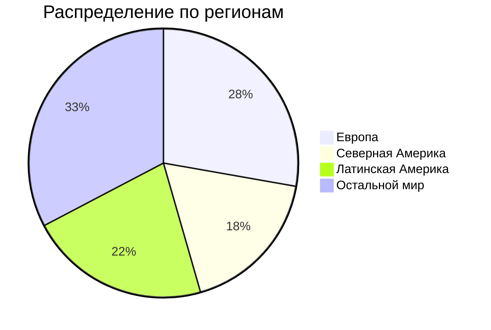

# ДЗ по курсу "Хайлоад"
## 1. Тема и целевая аудитория
### Тема
**Spotify** - стриминговый сервис для прослушивания музыки[^1]  
### Аудитория 
Согласно данным отчета за 2-й квартал 2024 года[^2], суммарное число активных пользователей сервиса за месяц составляет **626 млн**.

### Ключевой функционал
* регистрация;
* прослушивать музыку;
* создавать плейлисты;
* серверная история недавно прослушанных песен;
* плейлисты с рекомендациями;
* статистика по исполнителю;
* загрузка музыки;
* поиск музыки.
### Ключевые продуктовые решения
* композиции хранятся на серверах продукта.
## 2.Расчет нагрузки
### Продуктовые метрики
| Метрика                                          	        |                 Значение метрики 	|
|----------------------------------------------------------	|---------------------------------:	|
| Месячная аудитория                               	        |                          626 млн 	|
| Дневная аудитория                                	        |                     15.7 млн[^3] 	|
| Средний размер хранилища на пользователя         	        |                          ~25 МБ* 	|
| Среднее время прослушивания за день пользователем         | 148 минут (~40 разных песен)[^4] 	|
| Среднее количество созданных плейлистов за день	        |                      1.3 млн[^5] 	|
| Среднее количество добавлений песен в плейлисты за день	|                         31.4 млн  |
| Среднее количество поисков за день                        |                         62.8 млн 	|
| Среднее число регистраций/авторизаций за день             |                      15.83 млн** 	|

> \* *20 МБ как максимальный размер аватарки + мета информация о пользователе и его плейлистах*  
> \*\* авторизация активных пользователей в течение дня (15.7 млн) и регистрация новых (в среднем 130 тысяч)
### Технические метрики
#### Хранилища
Для вычисления объема хранилища, выделяемого на музыку, примем, что каждая песня сохраняется в 4 вариантах качества: низком, среднем, высоком и очень высоком и что всего их (на сентябрь 2024 года) 108 миллионов. Средний размер их (для песни длиной 3 минуты) соответственно составляет 540 КБ, 2.16 МБ, 3.6 МБ и 7.2 МБ[^6]. Таким образом, на каждую композицию выделяется в среднем 13.5 МБ, а общий объем хранилища можно принять равным: $108 млн \times 13.5$ МБ.

| Хранилище    	| Размер, ТБ 	|
|--------------	|-----------:	|
| Пользователи 	|      12520 	|
| Музыка       	|       1458 	|

#### Сетевой трафик
Битрейт песен в зависимости от качества составляет от 24 до 320 Кбит/c. Для вычисления сетевого трафика примем средний битрейт равным: $\frac{320 + 24}{4} = 150$ Кбит/с. 
| Действие пользователя 	| Среднее потребление в течение суток, Гбит/с 	| Пиковое потребление в течение суток, Гбит/с 	| Суммарный суточный, Гбайт/сутки 	|    RPS    	|
|---------------------    	|:-------------------------------------------:	|:-------------------------------------------:	|:-------------------------------:	|:---------:	|
| Прослушивание музыки  	|                    247.19                   	|                    741.6                    	|            20&nbsp;912&nbsp;400   | 1&nbsp;613&nbsp;611 	|
| Поиск                 	|                     8.72                    	|                    26.17                    	|              94&nbsp;200          |    727    	|
| Создание плейлиста    	|                    0.002                    	|                    0.006                    	|               20.8              	|     15    	|
| Добавление в плейлист 	|                     0.03                    	|                     0.09                    	|               314               	|    363    	|
| Регистрация/авторизация  	|                    0.024                   	|                    0.072                   	|               253.3              	|    183    	|

## 3. Глобальная балансировка нагрузки
### Функциональное разбиение по доменам
С точки зрения функциональности имеет смысл выделить 2 домена:
* **accounts.spotify.com** - регистрация и авторизация пользователей;
* **open.spotify.com** - для прослушивания музыки и связанных с этим действий.
### Обоснования расположения ДЦ
Согласно данным о распределении пользователей сервиса по странам[^7], разумнее всего в первую очередь использовать датацентры в США, Бразилии, Мексике, Великобритании и Индии. Более того, следует учесть расположение подводных кабелей[^8] и общее распределение трафика по различным частям света (п. 1). В результате были выбраны датацентры в городах:
* Хилсборо (США);
* Масатлан (Мексика);
* Форталеза (Бразилия);
* Атланта (США);
* Мумбаи (Индия);
* Кардифф (Великобритания);
* Марсель (Франция);
* Чикаго (США);
* Эдмонтон (Канада);
* Кордова (Аргентина);
* Люблин (Польша);
* Нью-Дели (Индия);
* Китаибараки (Япония);
* Сидней (Австралия);
* Стокгольм (Швеция);
* Стамбул (Турция).
### Схема DNS балансировки
Для балансировки DNS будет использована технология **latency-based DNS**, поскольку это поможет добиться минимальных задержек трафика, что является крайне важным для глобально доступного сервиса.

[^1]: [Spotify](https://open.spotify.com/)
[^2]: [Квартальный отчет](https://investors.spotify.com/financials/default.aspx#quarterly-results)
[^3]: [Hypestat](https://hypestat.com/info/spotify.com)
[^4]: [Insights into Spotify Listening Statistics: Millions of Users and Tracks](https://wifitalents.com/statistic/spotify-listening/)
[^5]: [Exploring Eye-Opening Spotify Playlist Statistics: 4 Billion Playlists Created](https://gitnux.org/spotify-playlist-statistics/)
[^6]: [How Much Data Does Spotify Use?](https://www.whistleout.com.au/MobilePhones/Guides/How-Much-Data-Does-Spotify-Use)
[^7]: [Spotify Users by Country 2024](https://worldpopulationreview.com/country-rankings/spotify-users-by-country)
[^8]: [Submarine Cable Map](https://www.submarinecablemap.com/)
