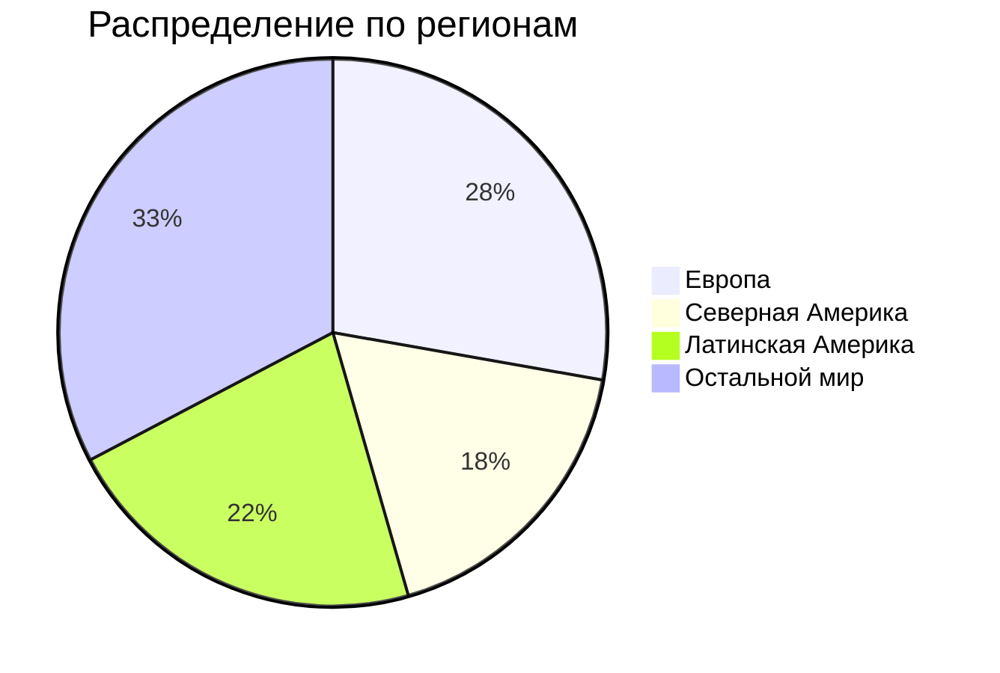

# ДЗ по курсу "Хайлоад"
## 1. Тема и целевая аудитория
### Тема
**Spotify** - стриминговый сервис для прослушивания музыки  
### Аудитория 
Согласно данным отчета за 2-й квартал 2024 года, суммарное число активных пользователей сервиса за месяц составляет **626 млн**.

### Ключевой функционал
* прослушивать музыку;
* создавать плейлисты;
* список музыки;
* серверная история прослушивания;
* поиск музыки.
### Ключевые продуктовые решения
* композиции хранятся на серверах продукта.
## Используемая литература
[1. Spotify](https://open.spotify.com/)
  
[2. Квартальный отчет](https://investors.spotify.com/financials/default.aspx#quarterly-results)
