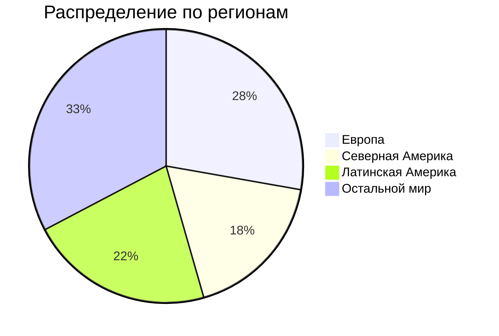

# ДЗ по курсу "Хайлоад"
## 1. Тема и целевая аудитория
### Тема
**Spotify** - стриминговый сервис для прослушивания музыки[^1]  
### Аудитория 
Согласно данным отчета за 2-й квартал 2024 года[^2], суммарное число активных пользователей сервиса за месяц составляет **626 млн**.

### Ключевой функционал
* регистрация;
* прослушивать музыку;
* создавать плейлисты;
* серверная история недавно прослушанных песен;
* плейлисты с рекомендациями;
* статистика по исполнителю;
* загрузка музыки;
* поиск музыки.
### Ключевые продуктовые решения
* композиции хранятся на серверах продукта.
## 2.Расчет нагрузки
### Продуктовые метрики
| Метрика                                          	        |                 Значение метрики 	|
|----------------------------------------------------------	|---------------------------------:	|
| Месячная аудитория                               	        |                          626 млн 	|
| Дневная аудитория                                	        |                     15.7 млн[^3] 	|
| Средний размер хранилища на пользователя         	        |                          ~25 МБ* 	|
| Среднее время прослушивания за день пользователем         | 148 минут (~40 разных песен)[^4] 	|
| Среднее количество созданных плейлистов за день	        |                      1.3 млн[^5] 	|
| Среднее количество добавлений песен в плейлисты за день	|                         31.4 млн  |
| Среднее количество поисков за день                        |                         62.8 млн 	|
| Среднее число регистраций/авторизаций за день             |                      15.83 млн** 	|

> \* *20 МБ как максимальный размер аватарки + мета информация о пользователе и его плейлистах*  
> \*\* авторизация активных пользователей в течение дня (15.7 млн) и регистрация новых (в среднем 130 тысяч)
### Технические метрики
#### Хранилища
Для вычисления объема хранилища, выделяемого на музыку, примем, что каждая песня сохраняется в 4 вариантах качества: низком, среднем, высоком и очень высоком и что всего их (на сентябрь 2024 года) 108 миллионов. Средний размер их (для песни длиной 3 минуты) соответственно составляет 540 КБ, 2.16 МБ, 3.6 МБ и 7.2 МБ[^6]. Таким образом, на каждую композицию выделяется в среднем 13.5 МБ, а общий объем хранилища можно принять равным: $108 млн \times 13.5$ МБ.

| Хранилище    	| Размер, ТБ 	|
|--------------	|-----------:	|
| Пользователи 	|      12520 	|
| Музыка       	|       1458 	|

#### Сетевой трафик
Битрейт песен в зависимости от качества составляет от 24 до 320 Кбит/c. Для вычисления сетевого трафика примем средний битрейт равным: $\frac{320 + 24}{4} = 150$ Кбит/с. 
| Действие пользователя 	| Среднее потребление в течение суток, Гбит/с 	| Пиковое потребление в течение суток, Гбит/с 	| Суммарный суточный, Гбайт/сутки 	|    RPS    	|
|---------------------    	|:-------------------------------------------:	|:-------------------------------------------:	|:-------------------------------:	|:---------:	|
| Прослушивание музыки  	|                    247.19                   	|                    741.6                    	|            20&nbsp;912&nbsp;400   | 1&nbsp;613&nbsp;611 	|
| Поиск                 	|                     8.72                    	|                    26.17                    	|              94&nbsp;200          |    727    	|
| Создание плейлиста    	|                    0.002                    	|                    0.006                    	|               20.8              	|     15    	|
| Добавление в плейлист 	|                     0.03                    	|                     0.09                    	|               314               	|    363    	|
| Регистрация/авторизация  	|                    0.024                   	|                    0.072                   	|               253.3              	|    183    	|

## 3. Глобальная балансировка нагрузки
### Функциональное разбиение по доменам
С точки зрения функциональности имеет смысл выделить 2 домена:
* **accounts.spotify.com** - регистрация и авторизация пользователей;
* **open.spotify.com** - для прослушивания музыки и связанных с этим действий.
### Обоснования расположения ДЦ
Согласно данным о распределении пользователей сервиса по странам[^7], разумнее всего в первую очередь использовать датацентры в США, Бразилии, Мексике, Великобритании и Индии. Более того, следует учесть расположение подводных кабелей[^8] и общее распределение трафика по различным частям света (п. 1). В результате были выбраны датацентры в городах:
* Хилсборо (США);
* Масатлан (Мексика);
* Форталеза (Бразилия);
* Атланта (США);
* Мумбаи (Индия);
* Кардифф (Великобритания);
* Марсель (Франция);
* Чикаго (США);
* Эдмонтон (Канада);
* Кордова (Аргентина);
* Люблин (Польша);
* Нью-Дели (Индия);
* Китаибараки (Япония);
* Сидней (Австралия);
* Стокгольм (Швеция);
* Стамбул (Турция).
Для раздачи статики будет использоваться CDN.
### Схема DNS балансировки
Для балансировки DNS будет использована технология **latency-based DNS**, поскольку это поможет добиться минимальных задержек трафика, что является крайне важным для глобально доступного сервиса.
## 4. Локальная балансировка нагрузки
### Схема балансировки для входящих и межсервисных запросов
Для обработки входящих запросов в ДЦ будем использовать L7 балансировку при помощи nginx, поскольку это позволит нам добиться наибольшей производительности при обработке запросов. Также nginx позволит нам более эффективно обслуживать длительные соединения и проверять авторизацию пользователей перед тем, как допускать их до сервиса.
Межсервисная балансировка будет обеспечиваться при помощи sidecar proxy, поскльку он позволит добиться меньшей задержки, чем другие способы.
### Схема отказоустойчивости
В первую очередь отказоустойчивость сервисов будет обеспечена средствами Kubernetes: auto-scaling для динамического изменения количества экземпляров в зависимости от нагрузки, автоматическое восстановление упавших узлов и так далее. nginx также сможет способствовать отказоустойчивости, перенаправляя запрос на другой сервер при слишком долгом таймауте. 
### Терминация SSL
Терминация SSL будет производиться при помощи session tickets. Это позволит ускорить процесс аутентификации и избавить сервер от необходимости кэшировать сессии.
## 5. Логическая схема БД

| Таблица       	|             Требования конситентности             	|                 Размеры данных (Гб)                 	    |
|---------------	|:-------------------------------------------------:	|:--------------------------------------------------------:	|
| User          	| id - PK email - уникальный  username - уникальный 	|   626 млн * (8 + (64 + 4) + (64 + 4) + (128 + 4)) байт = 172.8  |
| Profile       	|                      id - PK                      	| 626 млн * (8 + 2 + 4 + (64 + 4) + (255 + 4) + 1 + 8 + 8) байт =   	|
| Session       	|             user_id и session_id - PK             	|              15.7 млн * (8 + (64 + 4) + 1) байт =              	|
| Music         	|                      id - PK                      	| 108 млн * (8 + (64 + 4) + (255 + 4) + 2 + 8 + 8 + 1 + 8 + 8) байт =  	|
| Album         	|                      id - PK                      	|   8 млн * ((8 + (64 + 4) + (255 + 4) + 8 + 1 + 8 + 8) * 4) байт =     	|
| Artist        	|                      id - PK                      	|      8 млн * (8 + (64 + 4) + (255 + 4) + (128 + 4) + 1 + 8 + 8) байт =      	|
| Genre         	|                      id - PK                      	|              5000 * (8 + (64 + 4) + 1) байт =              	|
| Playlist      	|                      id - PK                      	|    8 млрд * (8 + (64 + 4) + (255 + 4) + 8 + 1 + 1 + 8 + 8) байт =    	|
| PlaylistMusic 	|            playlist_id и music_id - PK            	|            8 млрд * ((8 + 8 + 1) * 50) байт =             	|
| FavoriteMusic 	|              user_id и music_id - PK              	|          626 млн * ((8 + 8 + 1) * 500) байт =            	|
| WeeklyRecommendations 	|              user_id и music_id - PK              	|                     	|
| DailyRecommendations 	|              user_id и music_id - PK              	|                     	|
| ListeningHistory 	|              user_id и music_id - PK              	|                     	|

## 6. Физическая схема БД

### Индексы
| Таблица 	| Индексы 	|
|---	|---	|
| User 	| **email, username** - 2 отдельных индекса, поскольку пользователь может войти по любому из этих полей 	|
| Profile 	| **user_id** - для поиска информации о профиле после того, как пользователь вошел и user_id получен 	|
| Session 	| **session_id** - для поиска сессии по её идентификатору 	|
| Music 	| **id** - для поиска трека по id для плейлиста, списка избранного, истории прослушенного и рекомендаций name - для пользовательского поиска трека по его названию  album_id - для поиска песен из альбома genre_id - для поиска песен определенного жанра 	|
| Album 	| **id** - для поиска информации об альбоме для трека name - для пользовательского поиска альбома по его названию artist_id - для поиска альбомов определенного автора 	|
| Artist 	| **id** - для поиска информации об авторе для альбома name - для пользовательского поиска музыканта по его имени 	|
| Playlist 	| **name** - для пользовательского поиска плейлистов по их названию user_id - для поиска плейлистов конкретного пользователя 	|
| PlaylistMusic 	| **playlist_id** - для поиска музыки из конкретного плейлиста 	|
| FavoriteMusic 	| **user_id** - для поиска музыки из списка избранного конкретного пользователя 	|
| WeeklyRecommendations 	| **user_id** - для поиска музыки из списка рекомендаций конкретного пользователя 	|
| DailyRecommendations 	| **user_id** - для поиска музыки из списка рекомендаций конкретного пользователя 	|
| ListeningHistory 	| **user_id** - для поиска музыки из истории конкретного пользователя 	|
### Денормализация
В целях обеспечения более быстрого поиска и уменьшения количества JOIN-ов для таблиц PlaylistMusic, FavoriteMusic, ListeningHistory, DailyRecommendations, WeeklyRecommendations были добавлены поля artist_name, album_image и duration. В таблицу Music были добавлены поля artist_name, artist_image, album_name и album_image.
### Выбор СУБД
Для достаточной скорости обработки запросов и возможности горизонтального масштабирования в качестве СУБД была выбрана Cassandra. По таблицам ListeningHistory, FavoriteMusic, Profile, Music, Album и Artist также при помощи Kafka будут создаваться реплики на ClickHouse для выполнения аналитики.
### Шардирование
Будем шардировать пользователей и связанные с ними данные (User, Session, Profile, FavoriteMusic, ListeningHistory, DailyRecommendations, WeeklyRecommendations) в зависимости от страны их проживания. Остальные данные будем шардировать в зависимости от их идентификатора.
### Балансировка запросов / мультиплексирование подключений
Для распределения нагрузки будем использовать горячие реплики, механизм создания которых предоставляет Cassandra.
### Схема резервного копирования
Будем создавать бекап реплики данных для возможности восстановления данных.

[^1]: [Spotify](https://open.spotify.com/)
[^2]: [Квартальный отчет](https://investors.spotify.com/financials/default.aspx#quarterly-results)
[^3]: [Hypestat](https://hypestat.com/info/spotify.com)
[^4]: [Insights into Spotify Listening Statistics: Millions of Users and Tracks](https://wifitalents.com/statistic/spotify-listening/)
[^5]: [Exploring Eye-Opening Spotify Playlist Statistics: 4 Billion Playlists Created](https://gitnux.org/spotify-playlist-statistics/)
[^6]: [How Much Data Does Spotify Use?](https://www.whistleout.com.au/MobilePhones/Guides/How-Much-Data-Does-Spotify-Use)
[^7]: [Spotify Users by Country 2024](https://worldpopulationreview.com/country-rankings/spotify-users-by-country)
[^8]: [Submarine Cable Map](https://www.submarinecablemap.com/)
