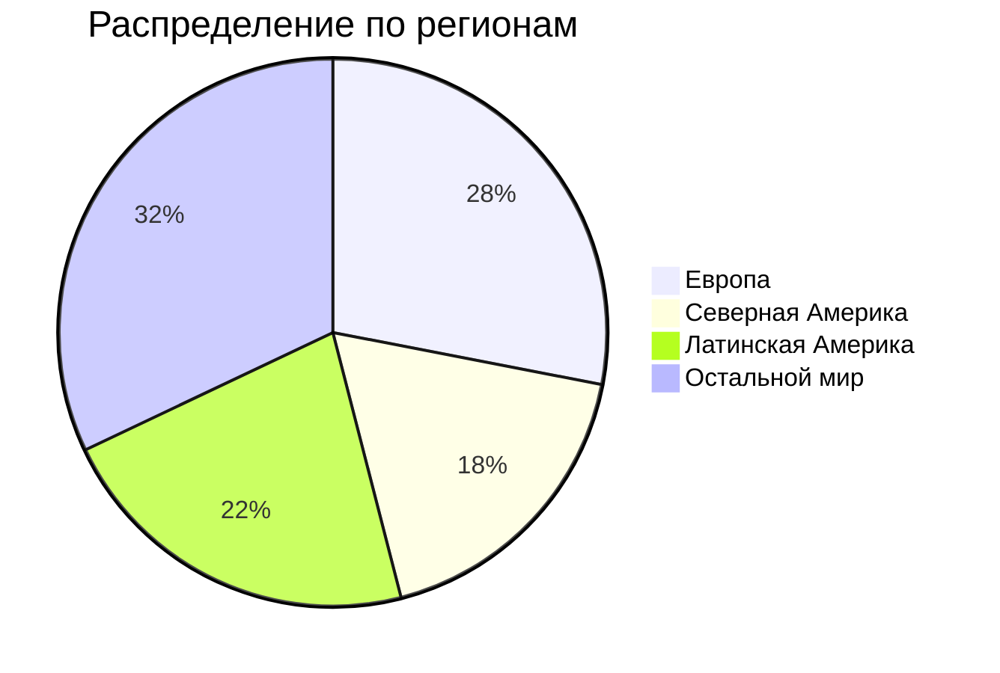

# ДЗ по курсу "Хайлоад"
## Содержание
1. [Тема и целевая аудитория](#1-тема-и-целевая-аудитория)
2. [Расчет нагрузки](#2-расчет-нагрузки)
3. [Глобальная балансировка нагрузки](#3-глобальная-балансировка-нагрузки)
4. [Локальная балансировка нагрузки](#4-локальная-балансировка-нагрузки)
5. [Логическая схема БД](#5-логическая-схема-бд)
6. [Физическая схема БД](#6-физическая-схема-бд)
7. [Алгоритмы](#7-алгоритмы)
8. [Технологии](#8-технологии)
9. [Схема проекта](#9-схема-проекта)
9. [Обеспечение надежности](#10-обеспечение-надёжности)
## 1. Тема и целевая аудитория
### Тема
**Spotify** - стриминговый сервис для прослушивания музыки[^1]  
### Аудитория 
Согласно данным отчета за 2-й квартал 2024 года[^2], суммарное число активных пользователей сервиса за месяц составляет **626 млн**.

### Ключевой функционал
* регистрация;
* прослушивать музыку;
* создавать плейлисты;
* серверная история недавно прослушанных песен;
* плейлисты с рекомендациями;
* статистика по исполнителю;
* загрузка музыки;
* поиск музыки.
### Ключевые продуктовые решения
* композиции хранятся на серверах продукта.
## 2. Расчет нагрузки
### Продуктовые метрики
| Метрика 	| Значение метрики 	|
|---	|---:	|
| Месячная аудитория 	| 626 млн 	|
| Дневная аудитория 	| 15.7 млн[^3] 	|
| Средний размер хранилища на пользователя 	| ~20 МБ* 	|
| Среднее время прослушивания за день пользователем 	| 148 минут (~40 разных песен)[^4] 	|
| Среднее количество созданных плейлистов за день 	| 1.3 млн[^5] 	|
| Среднее количество добавлений/удалений песен из плейлиста за день 	| 31.4 млн 	|
| Среднее количество поисков за день 	| 62.8 млн 	|
| Среднее число регистраций/авторизаций за день 	| 15.83 млн** 	|
| Среднее число изменения профилей 	| 100 тыс. 	|
| Среднее число запросов данных об альбомах в день на пользователя 	| 3 	|
| Среднее число запросов данных об исполнителях в день на пользователя 	| 2 	|
| Среднее число запросов жанров за день 	| 150 тыс. 	|
| Среднее число запросов плейлистов за день на пользователя 	| 2 	|
| Среднее число прослушиваний песен из плейлиста за день на пользователя 	| 8 	|
| Среднее число прослушиваний песен из избранного за день на пользователя 	| 18 	|
| Среднее число прослушиваний песен из недельной подборки за день на пользователя 	| 3 	|
| Среднее число прослушиваний песен из дневной подборки за день на пользователя 	| 10 	|
| Среднее число прослушиваний песен из истории за день на пользователя 	| 1 	|
| Среднее число пессен в плейлисте 	| 50 	|
| Среднее число песен в избранном 	| 500 	|
| Среднее число альбомов на исполнителя 	| 5 	|

> \* максимальный размер аватарки (~15 МБ с учетом сжатия WebP) + мета информация о пользователе и его плейлистах  
> \*\* авторизация активных пользователей в течение дня (15.7 млн) и регистрация новых (в среднем 130 тысяч)
### Технические метрики
#### Хранилища
Для вычисления объема хранилища, выделяемого на музыку, примем, что каждая песня сохраняется в 4 вариантах качества: низком, среднем, высоком и очень высоком и что всего их (на сентябрь 2024 года) 108 миллионов. Средний размер их (для песни длиной 3 минуты) соответственно составляет 540 КБ, 2.16 МБ, 3.6 МБ и 7.2 МБ[^6]. Таким образом, на каждую композицию выделяется в среднем 13.5 МБ.

| Хранилище 	| Размер, ТБ 	|
|---	|---	|
| Пользователи 	| 626 млн × 20  МБ = 12520	|
| Музыка 	| 108 млн × 13.5  МБ = 1458 	|

За последние несколько лет средний прирост пользователей составлял 15-20%. Если такой темп роста сохранится, то через год можно ожидать общей активной аудитории сервиса в районе 700 млн.  
Для расчета роста хранилища композиций учтем, что каждый день исполнители добавляют в среднем 60 тыс. новых песен[^7], что должно привести к росту библиотеки сервиса на 21.9 млн треков за год.

| Хранилище 	| Прирост за год, ТБ 	|
|---	|---	|
| Пользователи 	| 74 млн × 20  МБ = 1480	|
| Музыка 	| 21.9 млн × 13.5  МБ = 295.65 	|

#### Сетевой трафик
Для вычисления сетевого трафика прежде всего с помощью ручного замера инструментами разработчика браузера были получены средние размеры ответов на различные действия пользователя:
| Действие пользователя 	| Средний размер ответа, Кбайт 	|
|---	|---:	|
| Поиск 	| 1500 	|
| Создание плейлиста 	| 20 	|
| Добавление/удаление из плейлиста 	| 5.2 	|
| Запрос плейлиста (в т.ч. с рекомендациями) 	| 250 	|
| Регистрация/авторизация 	| 16 	|
| Запрос страницы исполнителя 	| 750 	|
| Запрос альбома 	| 30 	|
| Запрос страницы изменения профиля 	| 17000 	|
| Редактирование профиля 	| 30 	|

Битрейт песен в зависимости от качества составляет от 24 до 320 Кбит/c[^6]. Для вычисления сетевого трафика прослушивания музыки будем использовать средний битрейт, равный: (320 + 24) ÷ 4 = 150 Кбит/с.  
Пиковое суточное потребление примем за тройное среднее суточное потребление.
| Действие пользователя 	| Суммарный суточный, Гбайт/сутки 	| Среднее потребление в течение суток, Гбит/с 	| Пиковое потребление  в течение суток, Гбит/с 	| RPS 	|
|---	|:---:	|:---:	|:---:	|:---:	|
| Прослушивание музыки 	| 15.7&nbsp;млн × 148 × 60&nbsp;с × 150&nbsp;Кбит/c = 20&nbsp;912&nbsp;400 	| 20&nbsp;912&nbsp;400 × 8 ÷ 86&nbsp;400&nbsp;с = 1936.3 	| 5 809 	| 15.7&nbsp;млн × 148&nbsp;мин × 6* ÷ 86&nbsp;400&nbsp;с = 161&nbsp;361 	|
| Поиск 	| 62.8&nbsp;млн × 1500&nbsp;КБ = 94&nbsp;200 	| 94&nbsp;200 × 8 ÷ 86&nbsp;400&nbsp;с = 8.72 	| 26.17 	| 62.8&nbsp;млн ÷ 86&nbsp;400&nbsp;с = 727 	|
| Создание плейлиста 	| 1.3&nbsp;млн × 20&nbsp;КБ = 26 	| 26 × 8 ÷ 86&nbsp;400&nbsp;с = 0.0024 	| 0.006 	| 1.3&nbsp;млн ÷ 86&nbsp;400&nbsp;с = 15 	|
| Добавление/удаление из плейлиста 	| 31.4&nbsp;млн × 5.2&nbsp;КБ = 163.3 	| 163.3 × 8 ÷ 86&nbsp;400&nbsp;с = 0.015 	| 0.05 	| 31.4&nbsp;млн ÷ 86&nbsp;400&nbsp;с = 363 	|
| Запрос плейлиста 	| 15.7&nbsp;млн × 2 × 250&nbsp;КБ = 7850 	| 7850 × 8 ÷ 86&nbsp;400&nbsp;с = 0.72 	| 2.31 	| 15.7&nbsp;млн × 2 ÷ 86&nbsp;400&nbsp;с = 363	|
| Регистрация/авторизация 	| 15.83&nbsp;млн × 16&nbsp;КБ = 253.3 	| 253.3 × 8 ÷ 86&nbsp;400&nbsp;с = 0.024 	|  0.072 	| 15.83&nbsp;млн ÷ 86&nbsp;400&nbsp;с = 183 	|
| Запрос страницы артиста 	| 15.7&nbsp;млн × 2 × 750&nbsp;КБ = 23&nbsp;550 	| 23&nbsp;550 × 8 ÷ 86&nbsp;400&nbsp;с = 2.2 	|  6.6 	| 15.7&nbsp;млн × 2 ÷ 86&nbsp;400&nbsp;с = 363 	|
| Запрос альбома	| 15.7&nbsp;млн × 3 × 30&nbsp;КБ = 1&nbsp;413 	| 1&nbsp;413 × 8 ÷ 86&nbsp;400&nbsp;с = 0.13 	|  0.39 	| 15.7&nbsp;млн × 3 ÷ 86&nbsp;400&nbsp;с = 545 	|
| Редактирование профиля	| 100&nbsp;тыс. × (17000 + 30)&nbsp;КБ = 1&nbsp;703 	| 1&nbsp;703 × 8 ÷ 86&nbsp;400&nbsp;с = 0.16 	|  0.48 	| 100&nbsp;тыс. ÷ 86&nbsp;400&nbsp;с = 1 	|

> \* запрос данных песни происходит каждые 10 секунд (6 раз в минуту)  

## 3. Глобальная балансировка нагрузки
### Функциональное разбиение по доменам
Нет смысла выделять больше одного функционального домена, поскольку высокая нагрузка на сервера связана только с прослушиванием музыки.
### Обоснование выбора серверов
Для выбора серверов (ДЦ и CDN) будем учитывать данные о распределении пользователей сервиса по странам[^8], общее распределение трафика по различным частям света (п. 1), расположение подводных кабелей[^9] и плотность населения в разных частях света[^10].

> _синими маркерами_ обозначены города, в которых находятся датацентры  
> _оранжевыми маркерами_ обозначены местонахождения POP  
> _цветные линии_ - подводные кабели

#### Расположение CDN
Исходя из расчета сетевого трафика (п. 2), наибольшая нагрузка связана с прослушиванием музыки. Таким образом, вместо большого числа датацентров лучше использовать CDN для раздачи статики и стриминга музыки. Провайдером выберем Akamai, поскольку он обладает крупнейшей сетью CDN, очень тесно интегрированной с интернет-провайдерами. Это позволит добиться высокой скорости доставки контента пользователям по всему миру.

| Страна                  | Город                 | Обоснование выбора                                                                                         |
|:------------------------|-----------------------|------------------------------------------------------------------------------------------------------------|
| **США**                 | Нью-Йорк              | Крупный интернет-хаб, соединение с Европой через подводные кабели                                          |
|                         | Лос-Анджелес          | Близость к Азии, важный узел на Западном побережье                                                         |
|                         | Чикаго                | Центральное расположение в США, низкая задержка для внутренних соединений                                  |
|                         | Майами                | Шлюз к Латинской Америке и Карибскому региону                                                              |
|                         | Даллас                | Центр для южных штатов, хорошая связность с другими регионами США                                          |
| **Канада**              | Торонто               | Ведущий интернет-хаб Канады, близость к крупным городам Северной Америки                                   |
|                         | Ванкувер              | Связь с Тихоокеанским регионом, близость к Азии                                                            |
| **Мексика**             | Мехико                | Крупнейший город, обеспечивает покрытие по всей Мексике                                                    |
|                         | Гвадалахара           | Второй по величине город, резервирование и распределение нагрузки для региона                              |
| **Бразилия**            | Сан-Паулу             | Экономический центр, крупный интернет-хаб Южной Америки                                                    |
|                         | Рио-де-Жанейро        | Важный узел для восточного побережья, резервирование с Сан-Паулу                                           |
|                         | Форталеза             | Узел подключения к международным подводным кабелям в Атлантике                                             |
| **Аргентина**           | Буэнос-Айрес          | Основной интернет-центр Аргентины и южной части континента                                                 |
| **Чили**                | Сантьяго              | Основной интернет-хаб, соединение с подводными кабелями Тихого океана                                      |
| **Колумбия**            | Богота                | Ведущий интернет-центр региона Анд, соединение с остальной частью Латинской Америки                        |
| **Перу**                | Лима                  | Крупный город на побережье, доступ к подводным кабелям                                                     |
| **Эквадор**             | Кито                  | Поддержка трафика для региона Анд, стратегическое положение                                                |
| **Панама**              | Панама                | Важный транзитный узел для соединения Северной и Южной Америки                                             |
| **Уругвай**             | Монтевидео            | Доступ к подводным кабелям, резерв для Аргентины и Бразилии                                                |
| **Великобритания**      | Лондон                | Крупнейший интернет-центр Европы, соединение с США                                                         |
|                         | Манчестер             | Поддержка нагрузки для Северной Англии и резерв для Лондона                                                |
| **Германия**            | Франкфурт             | Основной интернет-хаб Германии и Европы, соединение с Восточной Европой                                    |
|                         | Берлин                | Поддержка и резерв для Франкфурта, центр для Восточной Европы                                             |
| **Франция**             | Париж                 | Крупный европейский хаб, соединение с Латинской Америкой и США через подводные кабели                      |
|                         | Марсель               | Входной узел для подводных кабелей из Африки и Ближнего Востока                                            |
| **Нидерланды**          | Амстердам             | Один из крупнейших интернет-узлов Европы, низкие задержки по всему континенту                              |
| **Испания**             | Мадрид                | Важный узел для Южной Европы, соединение с Латинской Америкой                                              |
|                         | Барселона             | Резерв и дополнительный узел для покрытия Южной Европы                                                     |
| **Италия**              | Милан                 | Интернет-хаб для Италии и Южной Европы, соединение с подводными кабелями                                   |
|                         | Рим                   | Поддержка и резерв для Милана                                                                              |
| **Швеция**              | Стокгольм             | Ведущий интернет-центр Северной Европы и стран Балтии                                                      |
| **Польша**              | Варшава               | Центр для Восточной Европы                                                                                 |
| **Швейцария**           | Цюрих                 | Низкие задержки для Центральной Европы, стабильная инфраструктура                                          |
| **Япония**              | Токио                 | Ведущий интернет-хаб Азии, соединение с подводными кабелями на США и остальной Азией                       |
|                         | Осака                 | Поддержка для Токио, резервирование для региона                                                            |
| **Южная Корея**         | Сеул                  | Интернет-центр для Кореи и соединение с Японией и Китаем                                                   |
| **Индия**               | Мумбаи                | Основной узел для интернета в Индии, соединение с подводными кабелями на Ближний Восток и Европу           |
|                         | Дели                  | Поддержка для Мумбаи, важный центр для Северной Индии                                                      |
|                         | Бангалор              | Центр для южной части Индии, технологический хаб                                                           |
| **Китай**               | Пекин                 | Важный узел для интернета, соединение с другими регионами Китая                                            |
|                         | Шанхай                | Крупнейший интернет-центр Восточного Китая, соединение с Японией и другими азиатскими странами             |
| **Сингапур**            | Сингапур              | Ключевой интернет-хаб Юго-Восточной Азии, соединение с подводными кабелями по всему миру                   |
| **Гонконг**             | Гонконг               | Узел для Восточной Азии, соединение с Китаем и Юго-Восточной Азией                                        |
| **Австралия**           | Сидней                | Крупнейший интернет-центр Австралии, соединение с Азией и США                                              |
|                         | Мельбурн              | Дополнительное покрытие для Австралии и резерв для Сиднея                                                  |
| **ОАЭ**                 | Дубай                 | Ведущий интернет-центр для Ближнего Востока, соединение с Европой и Азией                                  |
| **Саудовская Аравия**   | Эр-Рияд               | Поддержка для региона и резерв для Дубая                                                                  |
| **Южноафриканская Республика** | Йоханнесбург | Основной интернет-узел для Южной Африки, соединение с подводными кабелями на Европу                        |
| **Нигерия**             | Лагос                 | Крупный узел для Западной Африки, соединение с подводными кабелями                                         |

#### Расположение ДЦ
| Обслуживаемый регион 	| Название (страна и город) 	| Обоснование выбора 	|
|---	|---	|---	|
| Латинская Америка, Северная Америка 	| AngoNAP Fortaleza (Форталеза, Бразилия)	| - сертифицированный Tier-3 датацентр; - вблизи подводных кабелей, связывающих Латинскую Америку с Северной и Африкой; - большой трафик Spotify в Бразилии 	|
| Европа 	| Shield House (Глостер, Великобритания) 	| - сертифицированный Tier-3 датацентр; - вблизи большого числа подводных кабелей, соединяющих Великобританию почти со всем миром; - большой трафик Spotify в Великобритании 	|
| Африка, Азия, Океания и Австралия 	| STT Mumbai DC3 (Мумбаи, Индия) 	| - Tier-3 датацентр; - вблизи большого числа подводных кабелей, связывающих Индию с островами Океании и Австралией; - большой трафик Spotify в Индии	|

### Расчет распределения запросов по серверам
Для проведения расчетов будем пользоваться приведенной в п. 1 статистикой об использовании сервиса в разных частях света. Если на один регион приходится несколько серверов, примем, что нагрузка между ними распределена равномерно.
#### Расчет для CDN
| Страна 	| Трафик 	| RPS просулшивания музыки (на POP) 	|
|---	|---	|---	|
| США 	| 10% 	| 3227 	|
| Канада 	| 4% 	| 3227 	|
| Мексика 	| 4% 	| 3227 	|
| Бразилия 	| 8% 	| 4303 	|
| Аргентина 	| 2% 	| 3227 	|
| Чили 	| 2% 	| 3227 	|
| Колумбия 	| 2% 	| 3227 	|
| Перу 	| 2% 	| 3227 	|
| Эквадор 	| 2% 	| 3227 	|
| Панама 	| 2% 	| 3227 	|
| Уругвай 	| 2% 	| 3227 	|
| Великобритания 	| 4% 	| 3227 	|
| Германия 	| 4% 	| 3227 	|
| Франция 	| 4% 	| 3227 	|
| Нидерланды 	| 2% 	| 3227 	|
| Испания 	| 4% 	| 3227 	|
| Италия 	| 4% 	| 3227 	|
| Швеция 	| 2% 	| 3227 	|
| Польша 	| 2% 	| 3227 	|
| Швейцария 	| 2% 	| 3227 	|
| Япония 	| 4% 	| 3227 	|
| Южная Корея 	| 2% 	| 3227 	|
| Индия 	| 6% 	| 3227 	|
| Китай 	| 4% 	| 3227 	|
| Сингапур 	| 2% 	| 3227 	|
| Гонконг 	| 2% 	| 3227 	|
| Австралия 	| 4% 	| 3227 	|
| ОАЭ 	| 2% 	| 3227 	|
| Саудовская Аравия 	| 2% 	| 3227 	|
| Южноафриканская Республика 	| 2% 	| 3227 	|
| Нигерия 	| 2% 	| 3227 	|

#### Расчет для ДЦ
| Датацентр 	| Трафик 	|
|---	|---:	|
| AngoNAP Fortaleza (Форталеза, Бразилия)    | 40% 	|
| Shield House (Глостер, Великобритания) 	| 28%	|
| STT Mumbai DC3 (Мумбаи, Индия) 	| 32%	|

С учетом полученных данных можно провести итоговый расчет распределения RPS по датацентрам для различных действий пользователя (на основе расчетов из п. 2)
| Действие пользователя 	| RPS на AngoNAP Fortaleza  (Форталеза, Бразилия) 	| RPS на Shield House  (Глостер, Великобритания) 	| STT Mumbai DC3 (Мумбаи, Индия) 	|
|---	|---	|---	|---	|
| Поиск 	| 291 	| 204 	| 232 	|
| Создание плейлиста 	| 6 	| 4 	| 5 	|
| Добавление/удаление  из плейлиста 	| 145 	| 102 	| 116 	|
| Запрос плейлиста 	| 145 	| 102 	| 116 	|
| Регистрация/авторизация 	| 73 	| 51 	| 59 	|
| Запрос страницы артиста 	| 145 	| 102 	| 116 	|
| Запрос альбома 	| 218 	| 153 	| 174 	|
| Редактирование профиля 	| 0.4 	| 0.28 	| 0.32 	|
### Схема DNS балансировки
Для балансировки DNS будет использована технология **latency-based DNS**, поскольку это поможет добиться минимальных задержек трафика, что является крайне важным для глобально доступного сервиса.
## 4. Локальная балансировка нагрузки
### Схема балансировки для входящих запросов
* Для обработки входящих запросов в ДЦ будем использовать L7 балансировку при помощи **nginx**, поскольку это позволит нам добиться наибольшей производительности при обработке запросов. Также nginx позволит нам более эффективно обслуживать длительные соединения и проверять авторизацию пользователей перед тем, как допускать их до сервиса;
* будем применять 2 машины с nginx. Нагрузка будет балансироваться при помощи **BGP**: входящий в ДЦ трафик на маршрутизаторе будет равномерно при помощи ECMP распределяться между серверами с nginx. Для правильной работы такой схемы оба сервера должны аннонсировать в сеть один IP-адрес (Anycast IP) и располагаться симметрично на одинаковом сетевом расстоянии от маршрутизатора. При выходе одного сервера из строя весь трафик будет перенаправлен на второй.
### Схема балансировки для межсервисных запросов
Межсервисная балансировка будет обеспечиваться при помощи sidecar proxy, поскольку он позволит добиться меньшей задержки, чем другие технологии.
### Схема отказоустойчивости
* В первую очередь отказоустойчивость сервисов будет обеспечена средствами Kubernetes: auto-scaling для динамического изменения количества экземпляров в зависимости от нагрузки, автоматическое восстановление упавших узлов и т.д.;
* nginx также сможет способствовать отказоустойчивости, перенаправляя запрос на другой сервер при слишком долгом таймауте;
* балансировка nginx с BGP повысит отказоустойчиость системы, направляя весь трафик на рабочую машину при выходе из строя другой.  
### Терминация SSL
Терминация SSL будет производиться при помощи session tickets. Это позволит ускорить процесс аутентификации и избавить сервер от необходимости кэшировать сессии.
## 5. Логическая схема БД

| Таблица 	| Описание 	| Требования конситентности 	|
|---	|---	|---	|
| User 	| данные о пользователе для его идентификации и аутентификации 	| **id** - PK **email** - уникальный **username** - уникальный 	|
| Profile 	| данные о профиле пользователя 	| **id** - PK 	|
| Session 	| данные о сессиях 	| **user_id** и **session_id** - PK 	|
| Music 	| данные о музыке 	| **id** - PK 	|
| Album 	| данные об альбомах с музыкой 	| **id** - PK 	|
| Artist 	| данные об исполнителе 	| **id** - PK 	|
| Genre 	| название жанра по его id 	| **id** - PK 	|
| Playlist 	| данные о плейлисте 	| **id** - PK 	|
| PlaylistMusic 	| промежуточная таблица для создания связи между песнями и плейлистами, в которые они добавлены 	| **playlist_id** и **music_id** - PK 	|
| FavoriteMusic 	| промежуточная таблица между песнями и списками избранного пользователей 	| **user_id** и **music_id** - PK 	|
| WeeklyRecommendations 	| рекомендации на неделю для пользователей 	| **user_id** и **music_id** - PK 	|
| DailyRecommendations 	| рекомендации на день для пользователей 	| **user_id** и **music_id** - PK 	|
| ListeningHistory 	| история прослушиваний пользователей 	| **user_id** и **music_id** - PK 	|
| UserPreferences 	| предпочтения пользователей (в формате вектора дробных чисел) 	| **user_id** - PK 	|
| MusicFeatures 	| данные о параметрах конкретного трека (его темп, настроение и т.д.) 	| **music_id** - PK 	|
| UserInteraction 	| данные о взаимодействии пользователя с сервисом (лайки, дизлайки, пропуск трека и его прослушивание) 	| **id** - PK 	|

## 6. Физическая схема БД

> в таблице ListeningHistory сохраняется история прослушивания за 30 дней на пользователя;  
> в ClickHouse сохраняется история пользователей за более длительный срок (например, за несколько лет);  
> в UserInteraction сохраняются действия пользователя за последние несколько дней;  
> оригиналы статики сохранены в S3-хранилище.

### Выбор СУБД
#### Основное хранилище данных
Для Spotify - глобального сервиса стриминга музыки со значительным числом пользователей - важно:
* доступность данных по всему миру;
* высокая производительность;
* возможность простого горизонтального масштабирования;
* надежность и отказоустойчивость.

С учетом этих критериев в качестве основной СУБД была выбрана **Cassandra**. Одним из главных её преимуществ является возможность бесшовно добавлять в кластер новые узлы с линейным увеличением производительности. Это обеспечит миллионы операций чтения и большое число операций записи в секунду, глобальное покрытие и высокий уровень надежности и доступности данных.

_СУБД:_ Cassandra  
_Таблицы:_ все, кроме Session  

#### Сессии пользователей
При выборе СУБД для хранения сессий важно учитывать:
* необходима быстрая скорость и удобство работы с данными;
* нет нужды в сложных запросах;
* сама таблица будет иметь небольшой размер.

Лучше всего в таком случае подойдет **Redis**. Redis является in-memory СУБД с высокой скоростью чтения/записи, простым управлением данными и поддержкой TTL, что позволит автоматически удалять старые сессии. 

_СУБД:_ Redis  
_Таблица:_ Session  
#### Поиск
Для поиска необходим мощный движок с распределенной архитектурой и высокой скоростью работы. С этой целью будет применяться **ElasticSearch**, в который через Kafka Streams будут реплицироваться данные из таблиц с музыкой, исполнителями и плейлистами. Здесь использование потоковой обработки информации обусловлено в первую очередь необходимостью поддерживать данные в ElasticSearch в максимально актуальном состоянии и возможностью быстро и эффективно передавать большие объемы информации.

_СУБД:_ ElasticSearch  
_Таблицы (реплики):_ Music, Artist, Album, Playlist  
#### Действия пользователей
Отслеживать действия пользователей удобно будет при помощи **Kafka**. Данные о них будут передаваться в ClickHouse (полная история для аналитики) и в Cassandra в таблицу UserInteraction. 
#### Аналитика
Для больших OLAP-запросов лучше всего подойдет **ClickHouse** благодаря высокой скорости обработки больших объемов данных.

Возможность аналитики будет обеспечена реплицированием таблиц ListeningHistory, FavoriteMusic, Profile, Music и Artist. Они вместе с действиями пользователей (прослушивание музыки, пропуск трека, добавление в избранное и т.д.) будут обрабатываться и объединяться в Kafka, после чего передаваться в ClickHouse. Использовать Kafka в данном случае нужно в первую очередь для потоковой обработки больших объемов данных и их объединения с пользовательскими событиями, что позволит в дальнейшем производить более удобную и эффективную аналитику.

_СУБД:_ ClickHouse  
_Таблицы (реплики):_ ListeningHistory, FavoriteMusic, Profile, Music и Artist 

### Индексы
| Таблица 	| Индексы 	|
|---	|---	|
| User 	| **email, username** - 2 отдельных индекса, поскольку пользователь может войти по любому из этих полей 	|
| Profile 	| **user_id** - для поиска информации о профиле после того, как пользователь вошел и user_id получен 	|
| Session 	| **session_id** - для поиска сессии по её идентификатору 	|
| Music 	| **id** - для поиска трека по id для плейлиста, списка избранного, истории прослушенного и рекомендаций name - для пользовательского поиска трека по его названию  album_id - для поиска песен из альбома genre_id - для поиска песен определенного жанра 	|
| Album 	| **id** - для поиска информации об альбоме для трека **name** - для пользовательского поиска альбома по его названию **artist_id** - для поиска альбомов определенного автора 	|
| Artist 	| **id** - для поиска информации об авторе для альбома **name** - для пользовательского поиска музыканта по его имени 	|
| Playlist 	| **name** - для пользовательского поиска плейлистов по их названию **user_id** - для поиска плейлистов конкретного пользователя 	|
| PlaylistMusic 	| **playlist_id** - для поиска музыки из конкретного плейлиста 	|
| FavoriteMusic 	| **user_id** - для поиска музыки из списка избранного конкретного пользователя 	|
| WeeklyRecommendations 	| **user_id** - для поиска музыки из списка рекомендаций конкретного пользователя 	|
| DailyRecommendations 	| **user_id** - для поиска музыки из списка рекомендаций конкретного пользователя 	|
| ListeningHistory 	| **user_id** - для поиска музыки из истории конкретного пользователя 	|
| UserPreferences 	| **user_id** - для поиска по конкретному пользователю 	|
| MusicFeatures 	| **music_id** - для поиска по id песни **features_vector** - для поиска ближайших соседей при составлении рекомендаций 	|
| UserInteraction 	| **user_id** - для поиска по конкретному пользователю 	|

### Денормализация
В целях обеспечения более быстрого поиска и уменьшения количества JOIN-ов:
* для таблиц PlaylistMusic, FavoriteMusic, ListeningHistory, DailyRecommendations, WeeklyRecommendations были добавлены поля artist_name, album_image и duration;
* в таблицу Music были добавлены поля artist_name, artist_image, album_name и album_image.
### Шардирование
Данные таблиц будем шардировать в зависимости от идентификатора.
### Партиционирование
Таблицы DailyRecommendations и WeeklyRecommendations будут партиционироваться по дате их создания. Это позволит обеспечить более эффективную и быструю работу с нужными данными, поскольку увеличится вероятность попадания их в память и кэш.
### Клиентские библиотеки / интеграции
| Библиотека/интеграция 	| Применение 	|
|---	|---	|
| Netflix Priam 	| автоматизации создания бекапов данных из Cassandra 	|
| Debezium Cassandra Connector 	| отслеживание изменения данных в Cassandra и запись их в топики Kafka 	|
| Elastic Kafka Connector 	| отправка данных из Kafka в ElasticSearch 	|
| Faiss 	| создание индексов по векторам features_vector 	|

> для отправки данных в ClickHouse будет использован **ClickHouse Kafka Engine** - встроенный в ClickHouse механизм для работы с Kafka
### Балансировка запросов / мультиплексирование подключений
Для распределения нагрузки будем использовать горячие реплики, механизм создания которых предоставляет Cassandra.
### Схема резервного копирования
Будем делать бекап реплики данных с помощью Netflix Priam и механизма создания снепшотов в Cassandra.
### Расчет размера данных и нагрузки
Для проведения расчета принят _ряд допущений_:
* число песен в недельной подборке равно 30;
* число песен в дневной подборке равно 50;
* колонки preferences_vector в таблицы UserPreferences и features_vector в MusicFeatures хранят в себе 128 значений;
* для поиска подходящих песен в подборку будем анализировать 100 песен;

#### Расчет размера данных
| Таблица 	| Размеры данных (Гб) 	|
|---	|---	|
| User 	| 626 млн × (8 + 64 + 64 + 128) байт = 153.9 	|
| Profile 	| 626 млн × (8 + 2 + 4 + 64 + 255 + 1 + 8 + 8) байт = 204.1	|
| Session 	| 15.7 млн × (8 + 64 + 1) байт = 1.1	|
| Music 	| 108 млн × (8 + 64 + 255 + 2 + 8 + 8 + 64 + 255 + 64 + 255 + 1 + 8 + 8) байт = 100.6	|
| Album	| 8 млн × 5 * (8 + 64 + 255 + 8 + 1 + 8 + 8) байт = 13.1	|
| Artist 	| 8 млн × (8 + 64 + 255 + 128 + 1 + 8 + 8) байт = 3.5	|
| Genre 	| 5000 × (8 + 64 + 1) байт = 0.00034	|
| Playlist 	| 8 млрд × (8 + 64 + 255 + 8 + 1 + 1 + 8 + 8) байт = 2630.1	|
| PlaylistMusic 	| 8 млрд × 50 × (8 + 8 + 1 + 64 + 64 + 255 + 2) байт = 149&nbsp;756.7	|
| FavoriteMusic 	| 626 млн × 500 × (8 + 8 + 1 + 64 + 64 + 255 + 2) байт = 117&nbsp;184.6	|
| WeeklyRecommendations 	| 15.7 млн × 30 × 7 × (8 + 8 + 64 + 64 + 255 + 2 + 8) байт = 1255.9 	|
| DailyRecommendations| 15.7 млн × 50 × (8 + 8 + 64 + 64 + 255 + 2 + 8) байт = 299 	|
| ListeningHistory 	| 626 млн × 30 × 40 × (8 + 8 + 8 + 2 + 64 + 64 + 255 + 2 + 1 + 1) байт = 288&nbsp;938.7 |
| UserPreferences 	| 626 млн × (8 + 512 + 8) байт = 307.8    |
| UserInteraction 	| 626 млн × (8 + 8 + 8 + 16 + 8) байт = 28    |
| MusicFeatures 	| 108 млн × (8 + 128 × 4 + 8) байт = 53.1    |

#### Расчет нагрузки на чтение и запись
| Таблица 	| RPS на чтение 	| RPS на запись 	|
|---	|---	|---	|
| User 	| 15.7 млн ÷ 86400 = 182 	| 130000 ÷ 86400 = 1.5 	|
| Profile 	| 15.7 млн ÷ 86400 = 182 	| (130 + 100) тыс. ÷ 86400 = 3 	|
| Session 	| (15.7 млн ÷ 2) ÷ 86400 = 91 	| (15.7 млн + 130 тыс.) ÷ 86400 = 92	|
| Music 	| 40 × 15.7 млн ÷ 86400 = 7269 	| 60 тыс. ÷ 86400 = 1 	|
| Album 	| 3 × 15.7 млн ÷ 86400 = 545 	| 60 тыс. ÷ 10 ÷ 86400 = 0.1 	|
| Artist 	| 2 × 15.7 млн ÷ 86400 = 363 	| 2700 ÷ 86400 = 0 	|
| Genre 	| 150 тыс. ÷ 86400 = 2 	| 0 	|
| Playlist 	| 15.7 млн × 2 ÷ 86400 = 363 	| 1.3 млн ÷ 86400 = 15 	|
| PlaylistMusic 	| 15.7 млн × 8÷ 86400 = 1454 	| 31.4 млн ÷ 86400 = 363 	|
| FavoriteMusic 	| 15.7 млн × 18 ÷ 86400 = 3270 	| 15.7 млн ÷ 86400 = 182	|
| WeeklyRecommendations 	| 15.7 млн × 3 ÷ 86400 = 545 	| 15.7 млн × 30 ÷ 86400 = 5451 	|
| DailyRecommendations 	| 15.7 млн × 10 ÷ 86400 = 1817 	| 15.7 млн × 50 ÷ 86400 = 9086 	|
| ListeningHistory 	| 15.7 млн × 1 ÷ 86400 = 182 	| 40 × 15.7 млн ÷ 86400 = 7269 	|
| UserPreferences 	| 15.7 млн ÷ 86400 = 182 	| 15.7 млн × 3 ÷ 86400 = 545 	|
| UserInteraction 	| 15.7 млн × 3 ÷ 86400 = 545 	| 40 × 15.7 млн ÷ 86400 = 7269 	|
| MusicFeatures 	| 15.7 млн × 100 ÷ 86400 = 1817 	| 60 тыс. ÷ 86400 = 1 	|

## 7. Алгоритмы
| Алгоритм 	| Область применения 	| Мотивация 	|
|:---:	|:---:	|:---:	|
| Сбор пользовательских событий 	| Система рекомендаций 	| Это позволит учитывать поведение пользователя при составлении рекомендаций	|
| Content-Based фильтрация 	| Система рекомендаций 	| Это позволит реализовать систему рекомендаций и добиться индивидуального опыта прослушивания музыки для пользователей 	|
| Обновление пользовательских предпочтений 	| Система рекомендаций 	| Поддержание точности рекомендаций	|
| Кэширование на устройстве пользователя 	| Кэширование 	| Увеличение скорости проведения запросов и уменьшение нагрузки на сервера 	|
| Репликация данных из Cassandra в Clickhouse и ElasticSearch 	| Репликация данных 	| Создание реплик данных из Cassandra в Clickhouse для проведения аналитики по ним	|

### Сбор пользовательских событий
Описанный алгоритм реализует логику получаения, обработки и сохранения пользовательских действий для их дальнейшего использования в системе рекомендаций.

**Шаги алгоритма:**
1. Данные о пользовательских действиях попадают в соответствующие топики в Kafka, откуда они считываются в Kafka Streams.
2. Kafka Streams преобразует данные о действии в удобные для работы данные.
3. Собираем действия по пользователям в течение 1-2 минут.
4. Записываем данные в таблицу UserInteraction в Cassandra.
5. Записываем данные в ClickHouse.
  
> [!NOTE]
> Для обеспечения высокой производительности запись в Cassandra совершается с некоторой задержкой (1-2 минуты, как описано в п.3 алгоритма) и батчами.

### Content-Based фильтрация
При добавлении в библиотеку каждый трек анализируется при помощи **OpenL3** - обученной нейронной сети для представления аудиофайлов в удобном числовом виде. В результате для каждой песни будет создан features_vector, по которым затем можно будет удобно составлять плейлисты с рекомендациями по данному алгоритму. Для более быстрого поиска будет построен индекс по features_vector музыки с использованием **Faiss** (обновляется при добавлении новой песни).

**Шаги алгоритма:**
1. Получаем вектор предпочтений пользователя из таблицы UserPreferences.
2. Поиск ближайших соседей для данного пользователя среди features_vector-ов музыки.
3. Выбираем 50 треков для плейлиста.

### Обновление пользовательских предпочтений
Изначально для каждого нового пользователя будет назначаться вектор с некоторыми средними значениями предпочтений по всем пользователям. Раз в несколько дней на основе полученных пользовательских действий этот вектор будет обновляться. Данный алгоритм описывает этот процесс.

**Шаги алгоритма:**
1. Получаем данные о последних пользовательских действиях из таблицы UserInteractions.
2. Для каждого действия получаем features_vector песни.
3. На его основе изменяем вектор пользовательских предпочтений.

### Кеширование на устройстве пользователя
Чтобы снизить нагрузку на сервера и уменьшить задержку при стриминге музыки для пользователя, необходимо применять кеширование данных. Сохраняться в кеше будут статические данные (фрагменты музыки, картинки, CSS и JS в браузере), метаданные о песнях и исполнителях, то есть все данные, которые часто запрашиваются и практически не меняются.

**Шаги алгоритма**:
1. Приложение производит запрос данных с сервера.
2. Этот запрос прерывается, приложение пытается получиться необходимые данные из кеша.
3. В случае успеха используем кешированные данные.
4. При неудаче необходимо продолжить выполнение запроса на сервер; полученные в результате данные записываем в кеш. 

> [!NOTE]
> Необходимо следить за размером кеша, чтобы он не доставлял пользователям неудобств. Для этого будем удалять старые записи, которые давно не использовались, а также предоставлять пользователю возможность очищать кеш самостоятельно.

### Репликация данных из Cassandra в Clickhouse и ElasticSearch
Данные из Cassandra необходимо реплицировать в ClickHouse (для проведения аналитики) и в ElasticSearch (для эффективного индексирования и поиска). Приведенный ниже алгоритм описывает, как это происходит.

**Шаги алгоритма**:
1. Cassandra сохраняет изменения в свой журнал (CDC).
2. Данные об этих изменениях попадают в топики Kafka и затем в Kafka Streams.
3. В Kafka Streams данные обрабатываются и передаются в соответсвующую базу данных.

## 8. Технологии
| Технология 	| Область применения 	| Мотивация 	|
|---	|---	|---	|
| Golang 	| бекенд сервиса 	| современный ЯП с высокой производительностью, многопоточностью, большим числом встроенных библиотек и сильной поддержкой комьюнити 	|
| TypeScript 	| фронтенд сервиса 	| статическая типизация позволит избежать множества ошибок в процессе разработки и увеличить производительность написания кода  	|
| React 	| интерфейс сервиса 	| большое число интеграций и фреймворков, использующих эту библиотеку; поддержка мобильных платформ с помощью React Native 	|
| Vite 	| сборка фронтенда 	| высокая производительность, удобство разработки, поддержка других библиотек (React) 	|
| Zustand 	| хранение состояния 	| легковесная библиотека с высокой производительностью 	|
| Nginx* 	| балансировка внешней нагрузки 	| высокая производительность, эффективная терминация SSL 	|
| Cassandra 	| хранение данных для OLTP-запросов 	| высокая производительность, возможность масштабирования 	|
| Netflix Priam 	| создание реплик Cassanrda  	| глубокая интеграция с Cassandra 	|
| Redis 	| хранение данных сессии 	| высокопроизводительная in-memory база данных 	|
| ClickHouse 	| хранение данных для OLAP-запросов 	| высокопроизводительная аналитическая база данных 	|
| ElasticSearch 	| хранение данных и создание индексов по ним для эффективного поиска 	| высокопроизводительная база данных 	|
| Amazon S3 	| хранение оригиналов композиций	| масштабируемость, надежность, простая интеграция с Akamai 	|
| OpenL3 	| система рекомендаций 	| удобный механизм для анализа параметров песни (темп, настроение и так далее) 	|
| Faiss 	| система рекомендаций 	| высокая производительность поиска по векторам	|
| Prometheus 	| метрики 	| удобный механизм для сбора и хранения различных даннх продукта 	|
| Grafana 	| метрики 	| удобный механизм для визуализации собранных метрик 	|

> \* В качестве L7-балансировщика будет использован nginx, так как он обладает проверенной временем производительностью и надежностью, лучше подойдет для простой маршрутизации большого трафика и проверки авторизации пользователей. Envoy также является отличным кандидатом (особенно с учетом микросервисной архитектуры). Однако в данной системе его возможности не будут достаточно раскрыты в случае использование вместо nginx, поскольку общение микросервисов вынесено в отдельный слой (API-Gateway, п.9).

## 9. Схема проекта

### Пояснение к микросервисам
| Микросервис 	| Функционал 	|
|---	|---	|
| Authentication 	| Аутентификация и авторизация пользователей; управление сессиями 	|
| Music listening 	| Потоковое воспроизведение музыки 	|
| Profile 	| Регистрация пользователей; управление профилем пользователей; отслеживание понравившихся треков, истории прослушивания 	|
| Artist 	| Управление профилем исполнителя; добавление новых песен и создание альбомов 	|
| Playlists 	| Создание и редактирование плейлистов 	|
| Search 	| Поиск песен, исполнителей и плейлистов 	|
| Recommendations 	| Создание плейлистов с рекомендациями; получение уже созданных плейлистов с рекомендациями 	|
| User Interactions 	| Сбор и сохранение действий пользователя 	|
| Metrics 	| Сбор и сохранение технических метрик 	|
| Analytics 	| Проведение аналитики по данным пользователей 	|

## 10. Обеспечение надёжности
| Компонент 	| Обеспечение надежности 	|
|---	|---	|
| Backend 	| - средства Kubernetes (auto-scaling, восстановление упавших узлов, динамическое изменение числа экземпляров в зависимости от нагрузки и т.д.); - распределение нагрузки между ДЦ при помощи latency-based DNS; - распределение нагрузки в рамках ДЦ при помощи nginx; - сегментируем api: стримим музыку при помощи CDN, а остальные запросы обрабатываем в датацентрах; - будем кешировать данные на устройстве пользователя, чтобы уменьшить нагрузку на сервера; - для предотвращения вывода из строя всей системы будем применять паттерн Cuircuit Breaker: в зависимости от числа неудачных запросов микросервисы будут закрываться для доступа; - Graceful shutdown: плавная остановка работы сервиса (ждем закрытия всех активных соединений перед завершением работы); - Graceful degradation: пользователь сможет всегда прослушивать музыку даже при отказе каких-либо компонентов. 	|
| Nginx 	| при помощи технологии BGP: запросы, приходящие в ДЦ, на маршрутизаторе равномерно распределяются между двумя серверами с nginx. 	|
| БД 	| - создание бекап-реплик для возможности восстановления данных; - создание горячих реплик для возможности быстрой замены БД; - шардирование данных на основе идентификатора; - партиционирование данных рекомендаций на основе даты их создания; 	|
| Статика (музыка, аватарки) 	| оригиналы данных хранятся в централизованном S3-хранилище. 	|
| ДЦ 	| если какой-либо датацентр станет недоступен, запросы будут перенапрявляться в оставшиеся; чтобы они смогли выдержать увеличившуюся нагрузку, заранее будем учитывать такой сценарий при закупке оборудования	|

## 11. Список серверов
### Базовый расчет нагрузки
| Технология 	| Характер Сервиса 	| RPS 	| RAM, МБайт 	|
|---	|---	|---	|---	|
| Go 	| тяжелая бизнес-логика 	| 1 	| 30 	|
| Go 	| средняя бизнес-логика 	| 100 	| 50 	|
| Nginx 	| SSL handshake 	| 500 	| 10 	|
| Go 	| легкое JSON API 	| 5000 	| 200 	|

| Сервис 	| Целевая пиковая нагрузка приложения 	| CPU 	| RAM 	| Net, Гбит/с 	|
|---	|---	|---	|---	|---	|
| Authentication 	| 183 	|  	|  	| 0.072 	|
| Music listening 	| 161361 	|  	|  	| 5809 	|
| Profile 	| 182 + 3 = 185 	| 185 	| 7.4 	| 1.1 	|
| Artist 	| 363 	|  	|  	| 2.2 	|
| Playlists 	| 15 + 363 = 378 	|  	|  	| 0.006 + 0.05 	|
| Media storage 	|  	|  	|  	|  	|
| Search 	| 727 	|  	|  	| 26.17 	|
| Recommendations 	| 15.7 млн / 86400 = 182 	|  	|  	|  	|
| Metrics 	|  	|  	|  	|  	|
| Analytics 	|  	|  	|  	|  	|

[^1]: [Spotify](https://open.spotify.com/)
[^2]: [Квартальный отчет](https://investors.spotify.com/financials/default.aspx#quarterly-results)
[^3]: [Hypestat](https://hypestat.com/info/spotify.com)
[^4]: [Insights into Spotify Listening Statistics: Millions of Users and Tracks](https://wifitalents.com/statistic/spotify-listening/)
[^5]: [Exploring Eye-Opening Spotify Playlist Statistics: 4 Billion Playlists Created](https://gitnux.org/spotify-playlist-statistics/)
[^6]: [How Much Data Does Spotify Use?](https://www.whistleout.com.au/MobilePhones/Guides/How-Much-Data-Does-Spotify-Use)
[^7]: [Over 60,000 tracks are now uploaded to Spotify every day. That’s nearly one per second.](https://www.musicbusinessworldwide.com/over-60000-tracks-are-now-uploaded-to-spotify-daily-thats-nearly-one-per-second/)
[^8]: [Spotify Users by Country 2024](https://worldpopulationreview.com/country-rankings/spotify-users-by-country)
[^9]: [Submarine Cable Map](https://www.submarinecablemap.com/)
[^10]: [List of countries and dependencies by population density](https://en.wikipedia.org/wiki/List_of_countries_and_dependencies_by_population_density)
[^11]: [Techempower Benchmarks](https://www.techempower.com/benchmarks/#section=data-r22&test=fortune&hw=ph)
